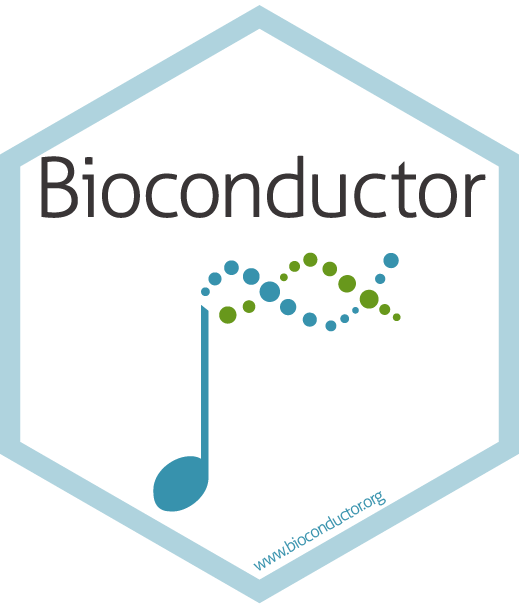
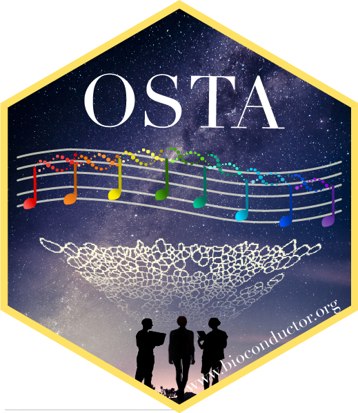

# Workflow: Visium HD cell-level

  

Authors: Yixing E. Dong[^readme-1], Ellis Patrick[^readme-2].

[^readme-1]: University of Lausanne, Lausanne, Switzerland

[^readme-2]: University of Sydney, Sydney, Australia

## Instructor name and contact information

-   Yixing Estella Dong ([estella.yixing.dong\@gmail.com](mailto:estella.yixing.dong@gmail.com){.email})
-   Ellis Patrick ([ellis.patrick\@sydney.edu.au](mailto:ellis.patrick@sydney.edu.au){.email})

### Pre-requisites

-   Intermediate knowledge of spatial transcriptomics
-   Intermediate knowledge of R syntax
-   Familiarity with `SpatialExperiment` classes and object manipulation
-   Familiarity with spatial `sf` classes and object manipulation

## Workshop description

In this instructor-led live demo, we analyze Visium HD data segmented into cells, demonstrating the use of the `SpatialFeatureExperiment` class in R to import, visualize, perform quality control, transfer labels from a single-cell reference to annotate the data, identify spatial domains, and select marker genes. Spatial transcriptomics (ST) data with annotated cell types can reveal key disease characteristics through neighborhood enrichment and spatial statistics, which will be demonstrated in the second half of the workshop. The complete analysis provided by existing tools highlights how easily researchers can transform raw counts from a Visium HD experiment into biological insights using Bioconductor and CRAN.

## To run locally

Clone the repo and follow the vignette in the `vignettes` folder. You will also need to install all the packages needed for the workshop. This can be done by

``` sh
devtools::install_github("estellad/EuroBioC2025_OSTA_Workshop")
```

## Docker image

A Docker image containing a complete version of all materials used in the workshop is also available.

First, download Docker as an Application and finish the installation. In a new tab of your terminal, make sure `which docker` is printed with a valid path.

Next, depending on the chip of your Mac, for instance, try one of the followings to download the container to your local machine. Note this can be a large download (disk usage: \~ 12 GB, content size \~ 4 GB).

``` sh
docker pull ghcr.io/estellad/eurobioc2025ostaworkshop:latest
```

``` sh
docker pull --platform linux/amd64 ghcr.io/estellad/eurobioc2025ostaworkshop:latest
```

To run the Docker image, run one of the followings, matching the previous platform specification:

``` sh
docker run -e PASSWORD=bioc -p 8787:8787 ghcr.io/estellad/eurobioc2025ostaworkshop:latest
```

``` sh
docker run --platform linux/amd64 -e PASSWORD=bioc -p 8787:8787 ghcr.io/estellad/eurobioc2025ostaworkshop:latest
```

Once running, navigate to <http://localhost:8787/> in your browser, and log in with username `rstudio` and password `bioc`.

## Links

-   Workshop website: <https://estellad.github.io/EuroBioC2025OSTAWorkshop>
-   Workshop repository: <https://github.com/estellad/EuroBioC2025OSTAWorkshop>
-   OSTA book website: <https://bioconductor.org/books/release/OSTA/>
-   OSTA book preprint: <https://www.biorxiv.org/content/10.1101/2025.11.20.688607v1>
-   OSTA repository: <https://github.com/lmweber/OSTA>

## Acknowledgments

-   OSTA book [contributors](https://lmweber.org/OSTA/pages/apx-acknowledgments.html)

-   10x Genomics [public data download](https://www.10xgenomics.com/datasets/visium-hd-cytassist-gene-expression-libraries-of-human-crc-v4)
